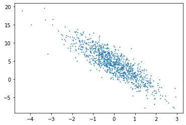

```python
import torch
import numpy as np
import random
import matplotlib.pyplot as plt
```

# 生成一个线性回归数据集
## y = Xw + b + ε
## 假设 w = [2,-3.4]T，b = 4.2，噪声ε～N(0,0.01^2)


```python
def synthetic_data(w,b,num_examples):
    #样本从标准正态分布中采集
    X = torch.normal(0,1,(num_examples,len(w)))
    y = X @ w + b
    y += torch.normal(0,0.01,y.shape)
    return X,y.reshape((-1,1))

true_w = torch.tensor([2,-3.4])
true_b = 4.2
features,labels = synthetic_data(true_w,true_b,1000)
```

# 线性回归从0开始实现
## 数据可视化展示
### plt.scatter(x,y,dot_size)绘制散点图
### torch.detach()切断计算图，防止反向传播更新


```python
plt.scatter(features[:,1].detach().numpy(),labels.detach().numpy(),1)
```


    <matplotlib.collections.PathCollection at 0x7fb2935bb610>


    

    


## 读取数据集


```python
##这种写法效率远低于框架的内置迭代器
def data_iter(batch_size,features,labels):
    num_examples = len(features)
    indices = list(range(num_examples))
    random.shuffle(indices)
    for i in range(0,num_examples,batch_size):
        batch_indices = torch.tensor(
            indices[i:min(i+batch_size,num_examples)])
        yield features[batch_indices],labels[batch_indices]
```

## 初始化模型参数


```python
w = torch.normal(0,0.01,size=(2,1),requires_grad=True)
b = torch.zeros(1,requires_grad=True)
```

## 定义线性回归模型


```python
def linreg(X,w,b):
    return X @ w + b
```

## 定义均方根损失函数


```python
def squared_loss(y_hat,y):
    return (y_hat - y.reshape(y_hat.shape)) ** 2 / 2
```

## 定义sgd优化算法


```python
def sgd(params,lr,batch_size):
    with torch.no_grad():
        for param in params:
            param -= lr * param.grad / batch_size
            param.grad.zero_()
```

## 训练


```python
lr = 0.03
num_epochs = 5
net = linreg
loss = squared_loss
batch_size = 10

for epoch in range(num_epochs):
    for X,y in data_iter(batch_size,features,labels):
        l = loss(net(X,w,b),y)
        l.sum().backward()
        sgd([w,b],lr,batch_size)
    with torch.no_grad():
        train_l = loss(net(features,w,b),labels)
        print('epoch '+str(epoch+1)+', loss '+str(float(train_l.mean())))
```

    epoch 1, loss 0.0319734662771225
    epoch 2, loss 0.0001028054830385372
    epoch 3, loss 4.8983471060637385e-05
    epoch 4, loss 4.8693174903746694e-05
    epoch 5, loss 4.866601011599414e-05


## 结果分析


```python
print('实际值: w = '+str(true_w)+' b = '+str(true_b))
print('估计值: w = '+str(w)+' b = '+str(b))
```

    实际值: w = tensor([ 2.0000, -3.4000]) b = 4.2
    估计值: w = tensor([[ 1.9999],
            [-3.4002]], requires_grad=True) b = tensor([4.2001], requires_grad=True)


# 线性回归简洁实现
## 构造迭代器


```python
from torch.utils.data import DataLoader
from torch.utils import data

dataset = data.TensorDataset(features,labels)
dataloader = DataLoader(dataset,batch_size=10,shuffle=True)
```

## 定义模型


```python
from torch import nn

net = nn.Sequential(
    nn.Linear(2,1)
)
```

## 初始化模型参数


```python
net[0].weight.data.normal_(0,0.01)
net[0].bias.data.fill_(0)
```


    tensor([0.])


## 定义均方根损失函数


```python
loss = nn.MSELoss()
```

## 定义优化器


```python
optimizer = torch.optim.SGD(net.parameters(),lr=0.03)
```

## 训练


```python
num_epochs = 3
for epoch in range(num_epochs):
    for X,y in dataloader:
        l = loss(net(X),y)
        optimizer.zero_grad()
        l.backward()
        optimizer.step()
        
    l = loss(net(features),labels)
    print('epoch '+str(epoch+1)+' loss '+str(float(l)))
```

    epoch 1 loss 0.00020478320948313922
    epoch 2 loss 9.735140338307247e-05
    epoch 3 loss 9.776937804417685e-05


## 结果分析


```python
print('实际值: w = '+str(true_w)+' b = '+str(true_b))
w = net[0].weight.data
b = net[0].bias.data
print('估计值: w = '+str(w)+' b = '+str(b))
```

    实际值: w = tensor([ 2.0000, -3.4000]) b = 4.2
    估计值: w = tensor([[ 1.9996, -3.4005]]) b = tensor([4.2003])

