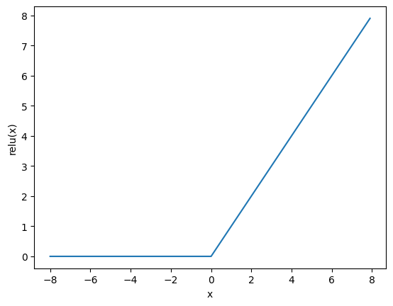
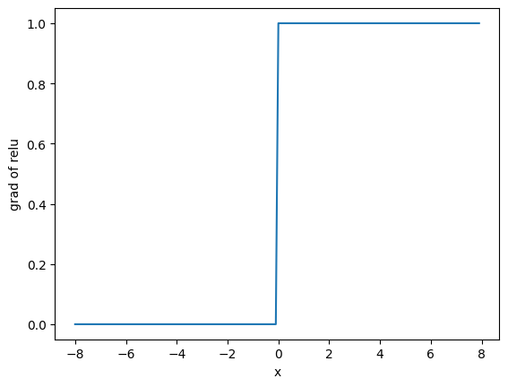
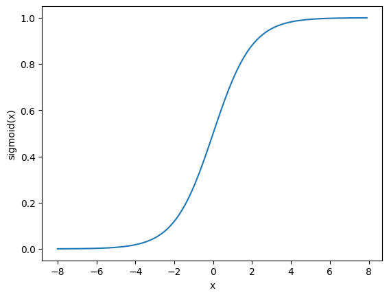
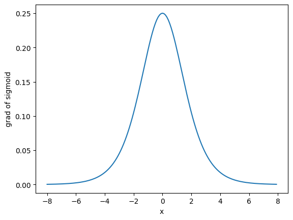
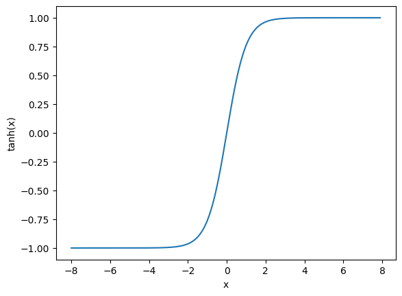
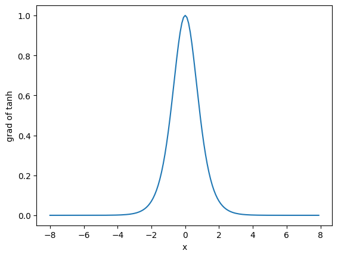
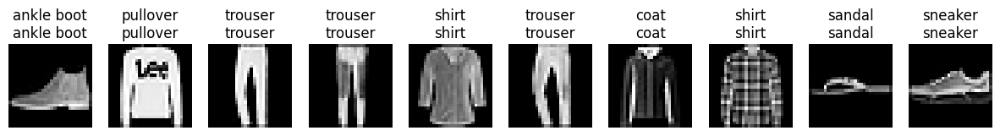

# Part1. 激活函数简介


```python
import torch
import matplotlib.pyplot as plt
```

## 1.1 ReLU


```python
x = torch.arange(-8.0, 8.0, 0.1, requires_grad=True)
y = torch.relu(x)

plt.xlabel("x")
plt.ylabel("relu(x)")
plt.plot(x.detach(), y.detach())
```


    [<matplotlib.lines.Line2D at 0x7f5cc5969310>]


    

    


```python
y.backward(torch.ones_like(x), retain_graph=True)

plt.xlabel("x")
plt.ylabel("grad of relu")
plt.plot(x.detach(), x.grad)
```


    [<matplotlib.lines.Line2D at 0x7f5cc58e44f0>]


    

    


## 1.2 sigmoid


```python
y = torch.sigmoid(x)

plt.xlabel("x")
plt.ylabel("sigmoid(x)")
plt.plot(x.detach(), y.detach())
```


    [<matplotlib.lines.Line2D at 0x7f5cc5865430>]


    

    


```python
x.grad.data.zero_()
y.backward(torch.ones_like(x), retain_graph=True)

plt.xlabel("x")
plt.ylabel("grad of sigmoid")
plt.plot(x.detach(), x.grad)
```


    [<matplotlib.lines.Line2D at 0x7f5cc5756340>]


    

    


## 1.3 tanh


```python
y = torch.tanh(x)

plt.xlabel("x")
plt.ylabel("tanh(x)")
plt.plot(x.detach(), y.detach())
```


    [<matplotlib.lines.Line2D at 0x7f5cc56eb9a0>]


    

    


```python
x.grad.data.zero_()
y.backward(torch.ones_like(x),retain_graph=True)

plt.xlabel("x")
plt.ylabel("grad of tanh")
plt.plot(x.detach(), x.grad)
```


    [<matplotlib.lines.Line2D at 0x7f5cc5e500d0>]


    

    


# Part.2 MLP从零实现


```python
import torch
import torchvision
from torch import nn
from torch.utils import data
from torchvision import transforms
```

## 2.1 构造数据迭代器


```python
def get_dataloader_workers():  #@save
    """使用4个进程来读取数据"""
    return 20

def load_data_fashion_mnist(batch_size, resize=None):  #@save
    """下载Fashion-MNIST数据集，然后将其加载到内存中"""
    trans = [transforms.ToTensor()]
    if resize:
        trans.insert(0, transforms.Resize(resize))
    trans = transforms.Compose(trans)
    mnist_train = torchvision.datasets.FashionMNIST(
        root="../data", train=True, transform=trans, download=True)
    mnist_test = torchvision.datasets.FashionMNIST(
        root="../data", train=False, transform=trans, download=True)
    return (data.DataLoader(mnist_train, batch_size, shuffle=True,
                            num_workers=get_dataloader_workers()),
            data.DataLoader(mnist_test, batch_size, shuffle=False,
                            num_workers=get_dataloader_workers()))

batch_size = 256
train_iter, test_iter = load_data_fashion_mnist(batch_size)
```

## 2.2 创建和初始化模型参数


```python
num_inputs, num_outputs, num_hiddens = 784, 10, 256

W1 = nn.Parameter(torch.randn(
    num_inputs, num_hiddens, requires_grad=True) * 0.01)
b1 = nn.Parameter(torch.zeros(num_hiddens, requires_grad=True))
W2 = nn.Parameter(torch.randn(
    num_hiddens, num_outputs, requires_grad=True) * 0.01)
b2 = nn.Parameter(torch.zeros(num_outputs, requires_grad=True))

params = [W1, b1, W2, b2]
```

## 2.3 激活函数


```python
def relu(X):
    a = torch.zeros_like(X)
    return torch.max(X, a)
```

## 2.4 模型架构


```python
def net(X):
    X = X.reshape((-1,num_inputs))
    H = relu(X @ W1 + b1)
    return (H @ W2 + b2)
```

## 2.5 损失函数


```python
loss = nn.CrossEntropyLoss(reduction='none')
```

## 2.6 计算精度


```python
def accuracy(y_hat, y):
    """计算预测正确的数量"""
    if len(y_hat.shape) > 1 and y_hat.shape[1] > 1:
        y_hat = y_hat.argmax(axis=1)
    cmp = y_hat.type(y.dtype) == y
    return float(cmp.type(y.dtype).sum())

def evaluate_accuracy(net, data_iter):  #@save
    """计算在指定数据集上模型的精度"""
    if isinstance(net, torch.nn.Module):
        net.eval()  # 将模型设置为评估模式
    metric = Accumulator(2)  # 正确预测数、预测总数
    with torch.no_grad():
        for X, y in data_iter:
            metric.add(accuracy(net(X), y), y.numel())
    return metric[0] / metric[1]

class Accumulator:  #@save
    """在n个变量上累加"""
    def __init__(self, n):
        self.data = [0.0] * n

    def add(self, *args):
        self.data = [a + float(b) for a, b in zip(self.data, args)]

    def reset(self):
        self.data = [0.0] * len(self.data)

    def __getitem__(self, idx):
        return self.data[idx]
```

## 2.7 训练


```python
def train_epoch_ch3(net, train_iter, loss, updater):  #@save
    """训练模型一个迭代周期（定义见第3章）"""
    # 将模型设置为训练模式
    if isinstance(net, torch.nn.Module):
        net.train()
    # 训练损失总和、训练准确度总和、样本数
    metric = Accumulator(3)
    for X, y in train_iter:
        # 计算梯度并更新参数
        y_hat = net(X)
        l = loss(y_hat, y)
        if isinstance(updater, torch.optim.Optimizer):
            # 使用PyTorch内置的优化器和损失函数
            updater.zero_grad()
            l.mean().backward()
            updater.step()
        else:
            # 使用定制的优化器和损失函数
            l.sum().backward()
            updater(X.shape[0])
        metric.add(float(l.sum()), accuracy(y_hat, y), y.numel())
    # 返回训练损失和训练精度
    return metric[0] / metric[2], metric[1] / metric[2]

def train_ch3(net, train_iter, test_iter, loss, num_epochs, updater):  #@save
    """训练模型（定义见第3章）"""
         
    for epoch in range(num_epochs):
        print(f"Epoch {epoch+1}\n-------------")
        train_metrics = train_epoch_ch3(net, train_iter, loss, updater)
        test_acc = evaluate_accuracy(net, test_iter)
        print(f"Train Loss: {train_metrics[0]}\n")
        print(f"Train Acc: {train_metrics[1]}\n")
        print(f"Test Acc: {test_acc}\n")
        
    train_loss, train_acc = train_metrics
    assert train_loss < 0.5, train_loss
    assert train_acc <= 1 and train_acc > 0.7, train_acc
    assert test_acc <= 1 and test_acc > 0.7, test_acc
```


```python
num_epochs, lr = 10, 0.1
updater = torch.optim.SGD(params, lr=lr)
train_ch3(net, train_iter, test_iter, loss, num_epochs, updater)
```

    Epoch 1
    -------------
    Train Loss: 1.0384934970855713
    
    Train Acc: 0.6440333333333333
    
    Test Acc: 0.7591
    
    Epoch 2
    -------------
    Train Loss: 0.6001383929570516
    
    Train Acc: 0.7894666666666666
    
    Test Acc: 0.7755
    
    Epoch 3
    -------------
    Train Loss: 0.5203199126561483
    
    Train Acc: 0.8192
    
    Test Acc: 0.813
    
    Epoch 4
    -------------
    Train Loss: 0.475564732170105
    
    Train Acc: 0.8341
    
    Test Acc: 0.8282
    
    Epoch 5
    -------------
    Train Loss: 0.4514418059031169
    
    Train Acc: 0.8421166666666666
    
    Test Acc: 0.8317
    
    Epoch 6
    -------------
    Train Loss: 0.43256086540222166
    
    Train Acc: 0.8478
    
    Test Acc: 0.7869
    
    Epoch 7
    -------------
    Train Loss: 0.41574843304951986
    
    Train Acc: 0.8545
    
    Test Acc: 0.8461
    
    Epoch 8
    -------------
    Train Loss: 0.401620364634196
    
    Train Acc: 0.8587
    
    Test Acc: 0.8397
    
    Epoch 9
    -------------
    Train Loss: 0.3914549509684245
    
    Train Acc: 0.8624333333333334
    
    Test Acc: 0.8477
    
    Epoch 10
    -------------
    Train Loss: 0.380827565574646
    
    Train Acc: 0.8662333333333333
    
    Test Acc: 0.8329
    


## 2.8 预测


```python
def get_fashion_mnist_labels(labels):  #@save
    """返回Fashion-MNIST数据集的文本标签"""
    text_labels = ['t-shirt', 'trouser', 'pullover', 'dress', 'coat',
                   'sandal', 'shirt', 'sneaker', 'bag', 'ankle boot']
    return [text_labels[int(i)] for i in labels]

def show_images(imgs, num_rows, num_cols, titles=None, scale=1.5):  #@save
    """绘制图像列表"""
    figsize = (num_cols * scale, num_rows * scale)
    figure = plt.figure(figsize=figsize)

    for i, img in enumerate(imgs):
        figure.add_subplot(num_rows,num_cols,i+1)
        if torch.is_tensor(img):
            # 图片张量
            plt.imshow(img.numpy(),cmap="gray")
        else:
            # PIL图片
            plt.imshow(img,cmap="gray")
        plt.axis("off")
        if titles:
            plt.title(titles[i])
    return plt

def predict_ch3(net, test_iter, n=10):  #@save
    """预测标签（定义见第3章）"""
    for X, y in test_iter:
        break
    trues = get_fashion_mnist_labels(y)
    preds = get_fashion_mnist_labels(net(X).argmax(axis=1))
    titles = [true +'\n' + pred for true, pred in zip(trues, preds)]
    show_images(X[0:n].reshape((n, 28, 28)), 1, n, titles=titles[0:n])
```


```python
predict_ch3(net, test_iter)
```


    

    


# Part.3 MLP简洁实现


```python
import torch
from torch import nn
```

## 3.1 模型搭建


```python
net = nn.Sequential(
    nn.Flatten(),
    nn.Linear(784,256),
    nn.ReLU(),
    nn.Linear(256,10)
)

def init_weights(m):
    if type(m) == nn.Linear:
        nn.init.normal_(m.weight, std=0.01)

net.apply(init_weights);
```

## 3.2 训练


```python
batch_size, lr, num_epochs = 256, 0.1, 10
loss = nn.CrossEntropyLoss(reduction='none')
trainer = torch.optim.SGD(net.parameters(), lr=lr)

train_iter, test_iter = load_data_fashion_mnist(batch_size)
train_ch3(net, train_iter, test_iter, loss, num_epochs, trainer)
```

    Epoch 1
    -------------
    Train Loss: 1.0363792786916097
    
    Train Acc: 0.6415333333333333
    
    Test Acc: 0.7304
    
    Epoch 2
    -------------
    Train Loss: 0.5970096253712972
    
    Train Acc: 0.7922666666666667
    
    Test Acc: 0.7798
    
    Epoch 3
    -------------
    Train Loss: 0.5203316651662191
    
    Train Acc: 0.8192
    
    Test Acc: 0.8165
    
    Epoch 4
    -------------
    Train Loss: 0.48169166253407797
    
    Train Acc: 0.831
    
    Test Acc: 0.8271
    
    Epoch 5
    -------------
    Train Loss: 0.4527926306406657
    
    Train Acc: 0.8409833333333333
    
    Test Acc: 0.8295
    
    Epoch 6
    -------------
    Train Loss: 0.43368616282145184
    
    Train Acc: 0.84655
    
    Test Acc: 0.8139
    
    Epoch 7
    -------------
    Train Loss: 0.4174125926335653
    
    Train Acc: 0.85275
    
    Test Acc: 0.8328
    
    Epoch 8
    -------------
    Train Loss: 0.402970679918925
    
    Train Acc: 0.8581
    
    Test Acc: 0.8435
    
    Epoch 9
    -------------
    Train Loss: 0.39425219141642254
    
    Train Acc: 0.8607166666666667
    
    Test Acc: 0.8428
    
    Epoch 10
    -------------
    Train Loss: 0.38379729283650715
    
    Train Acc: 0.8657666666666667
    
    Test Acc: 0.8465
    

